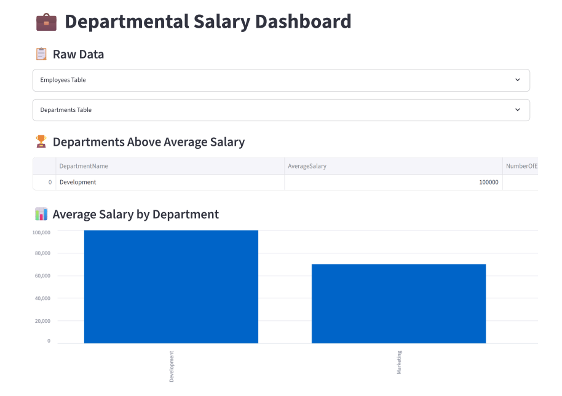
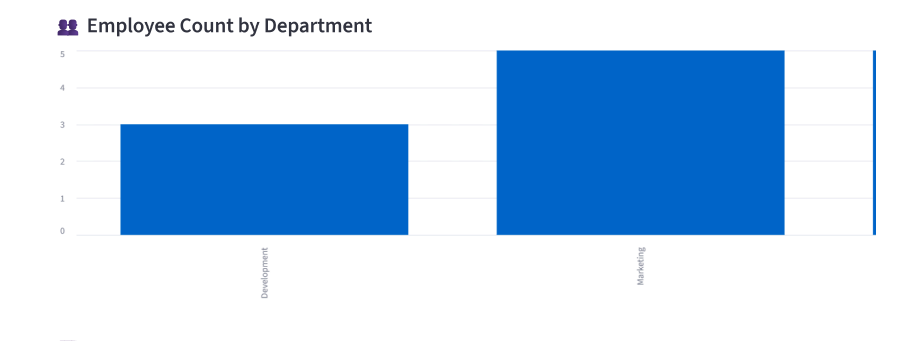
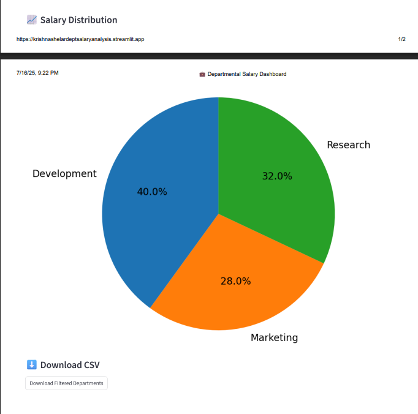

# 💼 Departmental Salary Dashboard

This is a Streamlit-powered dashboard that analyzes employee salary data across departments and highlights departments where the **average salary exceeds the overall average**.

<p align="left">
  
    
  
  
</p>

🔗 **Live App**: [https://dept-salary-analysis-krishnashelar.streamlit.app/](https://dept-salary-analysis-krishnashelar.streamlit.app/)

---

## 📊 Features

- 📋 View raw data tables (Employees and Departments)
- 🏆 Highlight departments with above-average salaries
- 📊 Bar charts:
  - Average Salary per Department
  - Employee Count per Department
- 📈 Pie chart: Salary Distribution by Department
- ⬇️ Download filtered results as CSV

---

## 🗃️ Dataset

### `EmployeesTable.csv`
| EmployeeID | Name               | DepartmentID | Salary     |
|------------|--------------------|--------------|------------|
| 1          | John Doe           | 1            | 60000.00   |
| 2          | Jane Smith         | 1            | 70000.00   |
| 3          | Alice Johnson      | 1            | 65000.00   |
| 4          | Bob Brown          | 1            | 75000.00   |
| 5          | Charlie Wilson     | 1            | 80000.00   |
| 6          | Eva Lee            | 2            | 70000.00   |
| 7          | Michael Clark      | 2            | 75000.00   |
| 8          | Sarah Davis        | 2            | 80000.00   |
| 9          | Ryan Harris        | 2            | 85000.00   |
| 10         | Emily White        | 2            | 90000.00   |
| 11         | David Martinez     | 3            | 95000.00   |
| 12         | Jessica Taylor     | 3            | 100000.00  |
| 13         | William Rodriguez  | 3            | 105000.00  |

### `DepartmentsTable.csv`
| DepartmentID | Name        |
|--------------|-------------|
| 1            | Marketing   |
| 2            | Research    |
| 3            | Development|

---
## 📌 Tools & Technologies

- 🐍 **Python 3.12**
- 📊 **Pandas**, **Matplotlib**
- 🌐 **Streamlit**
- 💾 **Git & GitHub**
---
  
## 👨‍💻 Developed by

**Krishna Shelar**  
🎓 **B.Tech CSE**, Sanjivani College of Engineering, Kopargaon  
💼 **SQL Intern – Celebal Technologies**  
📅 **Project Date**: July 2025

---

## 📸 Preview

Here are some snapshots of the live dashboard:

### 🔹 Main Dashboard View


### 🔹 Departmental Salary Insights


### 🔹 Download Section and Pie Chart


---
## 🧮 SQL Query

The core SQL logic that powers this analysis is written in MySQL.

📁 [View SQL File](sql/Department_Salary_Analysis.sql)

### 🔍 Query Highlights:
- Calculates average salary per department
- Computes overall average salary
- Filters departments whose average salary is **above the overall average**
- Uses **CTEs** (Common Table Expressions) for better readability

This query is used as the foundation for both:
- 📊 The Streamlit dashboard (via Pandas)
- 📈 The Power BI visualization (via Power Query/DAX)

---

## 📊 Power BI Dashboard

In addition to the Streamlit version, this project is also implemented using **Power BI Desktop**.


📁 [Download Power BI Project File (.pbix)](PowerBI%20Dashboard/DeptSalaryAnalysis.pbix)

📷 **Dashboard Previews**:

  


### ✅ Power BI Highlights:
- Avg Salary by Department
- Min/Max Salary and Headcount
- Above/Below Average Segmentation using DAX
- Interactive visuals and filters

 
  ## 🚀 How to Run Locally

```bash
git clone https://github.com/Krish1712204/Department_Salary_Analysis_.git
pip install -r requirements.txt
streamlit run app.py
  ---
  

